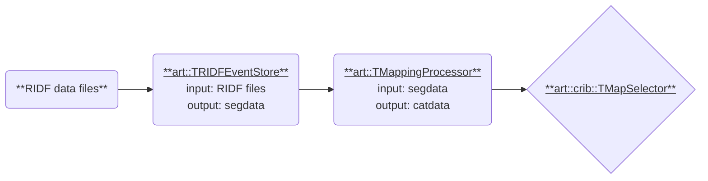

# Mapping Processors

この説では、`art::TMappingProcessor`で、データを分類した`catdata`を用いて新しいプロセッサを作る方法を説明します。
データの分類は、`mapper.conf`と`conf/map`ファイルで行います。
マップファイルの作成については、[Map Configuration](../preparation/map.md)のページを参照してください。

ここでは、マップファイルで定義されている id を用いて一つのデータを抜き出し、それのデータをシンプルなデータ型に詰めるようなプロセッサを作成しながら、`catdata`の構造を把握します。
大まかな流れは[前節](./seg_data.md)と同様です。

## プロセッサの概要



次のようなプロセッサの作成を行います。

- 名前: `TMapSelector`
- 名前空間: `art::crib` (CRIB で開発したコードにつける)
- 入力: `catdata`
- 出力: `TClonesArray`の要素として`art::TSimpleData`を詰めたブランチ

例えば、マップファイルとして以下のようなものを準備したときに、一行目の`catid`、二行目の`id`、5 つの数字の組で指定されている`segid`が複数ある場合、それを指定する数字の 3 つの数字で抜き出したいデータを指定します。

```plaintext
10, 0,  12 1  6   3  0,  12 2  7  0  16
10, 1,  12 1  6   3  1,  12 2  7  0  17
```

例えば、`CatID: [10, 1, 2]`と指定した場合、`segid = [12, 2, 7, 0 ,17]`のデータを抜き出します。

## steering ファイルの例

steering ファイルから、`CatID`と出力するブランチの名前を指定できるようにしておきます。
全体像はこのようになります。

```yaml
Anchor:
  - &input ridf/@NAME@@NUM@.ridf
  - &output output/@NAME@/@NUM@/test@NAME@@NUM@.root

Processor:
  - name: timer
    type: art::TTimerProcessor

  - name: ridf
    type: art::TRIDFEventStore
    parameter:
      OutputTransparency: 1
      InputFiles:
        - *input

  - name: mapper
    type: art::TMappingProcessor
    parameter:
      OutputTransparency: 1

  - name: map_channel
    type: art::crib::TMapSelector
    parameter:
      OutputCollection: channel
      CatIDs: [10, 1, 2]

  - name: outputtree
    type: art::TOutputTreeProcessor
    parameter:
      FileName:
        - *output
```

## `catdata`を理解する

まず、`TMapSelector`という名前でヘッダファイルとソースファイルの作成を行います。
詳細は省略しますが、`artcrib_linkdef.h`と`CMakeLists.txt`にも登録することを忘れないでください。
詳細は[前節](./seg_data.md)を参照してください。

skelton コードで問題なくビルドできるようになったら、`art::TMappingProcessor`から出力される`catdata`を受け取れるようにします。
`segdata`の時と同様です。

### ヘッダファイル

```cpp
#ifndef _CRIB_TMAPSELECTOR_H_
#define _CRIB_TMAPSELECTOR_H_

#include "TProcessor.h"

class TClonesArray;

namespace art {
class TCategorizedData;
} // namespace art

namespace art::crib {
class TMapSelector : public TProcessor {
  public:
    TMapSelector();
    ~TMapSelector();

    void Init(TEventCollection *col) override;
    void Process() override;

  private:
    TString fCategorizedDataName;
    TString fOutputColName;

    Int_t fCatID; //!

    TCategorizedData *fCategorizedData; //!
    TClonesArray *fOutData;             //!

    TMapSelector(const TMapSelector &) = delete;
    TMapSelector &operator=(const TMapSelector &) = delete;

    ClassDefOverride(TMapSelector, 0);
};
} // namespace art::crib

#endif // end of #ifndef _CRIB_TMAPSELECTOR_H_
```

### ソースファイル

```cpp
#include "TMapSelector.h"

#include <TCategorizedData.h>
#include <vector>

ClassImp(art::crib::TMapSelector);

namespace art::crib {
TMapSelector::TMapSelector() : fCategorizedData(nullptr), fOutData(nullptr) {
    RegisterInputCollection("CategorizedDataName", "name of the segmented data",
                            fCategorizedDataName, TString("catdata"));
    RegisterOutputCollection("OutputCollection", "name of the output branch",
                             fOutputColName, TString("channel"));

    RegisterProcessorParameter("CatID", "categorized ID, (catid)",
                               fCatID, -1);
}

void TMapSelector::Init(TEventCollection *col) {
    // Categorized data initialization
    auto cat_ref = col->GetObjectRef(fCategorizedDataName);
    if (!cat_ref) {
        SetStateError(Form("No input collection '%s'", fCategorizedDataName.Data()));
        return;
    }

    auto cat_obj = static_cast<TObject *>(*cat_ref);
    if (!cat_obj->InheritsFrom("art::TCategorizedData")) {
        SetStateError(Form("Invalid input collection '%s': not TCategorizedData",
                           fCategorizedDataName.Data()));
        return;
    }
    fCategorizedData = static_cast<TCategorizedData *>(cat_obj);

    // CatID validation
    if (fCatID < 0) {
        SetStateError(Form("CatID is invalid: %d", fCatID));
        return;
    }

    fOutData = new TClonesArray("std::vector<int>");
    fOutData->SetName(fOutputColName);
    col->Add(fOutputColName, fOutData, fOutputIsTransparent);
    Info("Init", "%s -> %s, CatID = %d",
         fCategorizedDataName.Data(), fOutputColName.Data(), fCatID);
}
} // namespace art::crib
```
