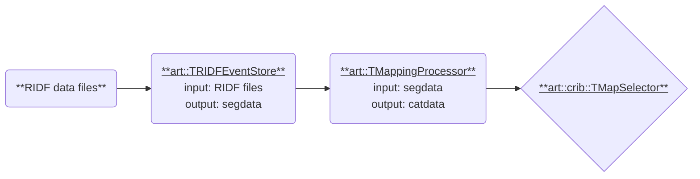

# Mapping Processors

```mermaid
flowchart LR
    A("**RIDF data files**") --> B("<u>**art::TRIDFEventStore**</u><br>input: RIDF files<br>output: segdata")
    B --> C("<u>**art::TMappingProcessor**</u><br>input: segdata<br>output: catdata")
    C --> D{"<u>**art::crib::TMapSelector**</u>"}
```
