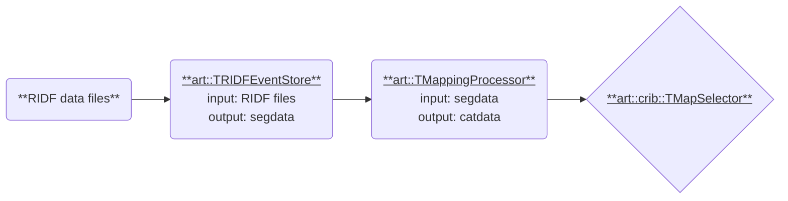

# Processing Categorized Data

This section explains how to create a new processor using categorized data (`catdata`) generated by `art::TMappingProcessor`.
Such processors are referred to as **`Mapping Processors`**.
The classification of data is defined in the `mapper.conf` and `conf/map` files.
For details on creating map files, see [Map Configuration](../preparation/map.md).

In this section, we will:

1. Create a processor to extract specific data defined in the map file and store it in `art::TSimpleData`.
2. Explore the structure of `catdata`.

The overall process is similar to what was discussed in the [previous section](./seg_data.md).

## Processor Overview



We will create the following processor:

- **Name**: `TMapSelector`
- **Namespace**: `art::crib` (for CRIB-specific code)
- **Input**: `catdata`
- **Output**: A branch with elements of `art::TSimpleData` stored in a `TClonesArray`

### Map File Example

A sample map file looks like this:

```plaintext
10, 0,  12 1  6   3  0,  12 2  7  0  16
10, 1,  12 1  6   3  1,  12 2  7  0  17
```

In this format:

- The first column specifies the `catid`.
- The second column specifies the `detid`.
- Subsequent groups of five numbers represent `segid` values, with `typeid` differentiating between these groups.

For example, specifying `CatID: [10, 1, 1]` extracts `segid = [12, 2, 7, 0, 17]`.

## Example Steering File

A steering file is used to define parameters like `CatID` and the output branch name.
Below is a sample configuration:

```yaml
Anchor:
  - &input ridf/@NAME@@NUM@.ridf
  - &output output/@NAME@/@NUM@/test@NAME@@NUM@.root

Processor:
  - name: timer
    type: art::TTimerProcessor

  - name: ridf
    type: art::TRIDFEventStore
    parameter:
      OutputTransparency: 1
      InputFiles:
        - *input

  - name: mapper
    type: art::TMappingProcessor
    parameter:
      OutputTransparency: 1

  - name: map_channel
    type: art::crib::TMapSelector
    parameter:
      OutputCollection: channel
      CatIDs: [10, 1, 1]

  - name: outputtree
    type: art::TOutputTreeProcessor
    parameter:
      FileName:
        - *output
```

## Working with `catdata`

### Creating `TMapSelector`

Begin by creating the header and source files for TMapSelector.
Don’t forget to register these files in `artcrib_linkdef.h` and `CMakeLists.txt`.
For details, refer to the [General processor](./general_processors.md).

### Header File

The header file defines the required components and variables for handling `catdata`:

```cpp
#ifndef _CRIB_TMAPSELECTOR_H_
#define _CRIB_TMAPSELECTOR_H_

#include "TProcessor.h"

class TClonesArray;

namespace art {
class TCategorizedData;
} // namespace art

namespace art::crib {
class TMapSelector : public TProcessor {
  public:
    TMapSelector();
    ~TMapSelector();

    void Init(TEventCollection *col) override;
    void Process() override;

  private:
    TString fCategorizedDataName;
    TString fOutputColName;

    IntVec_t fCatID; //! [cid, id, type]

    TCategorizedData *fCategorizedData; //!
    TClonesArray *fOutData;             //!

    TMapSelector(const TMapSelector &) = delete;
    TMapSelector &operator=(const TMapSelector &) = delete;

    ClassDefOverride(TMapSelector, 1);
};
} // namespace art::crib

#endif // end of #ifndef _CRIB_TMAPSELECTOR_H_
```

### Source File

Prepare the source file to receive `catdata` in a manner similar to how `segdata` is handled.
The `Process()` method will be implemented later.

```cpp
#include "TMapSelector.h"

#include <TCategorizedData.h>
#include <TRawDataObject.h>
#include <TSimpleData.h>

ClassImp(art::crib::TMapSelector);

namespace art::crib {
TMapSelector::TMapSelector() : fCategorizedData(nullptr), fOutData(nullptr) {
    RegisterInputCollection("CategorizedDataName", "name of the segmented data",
                            fCategorizedDataName, TString("catdata"));
    RegisterOutputCollection("OutputCollection", "name of the output branch",
                             fOutputColName, TString("channel"));

    IntVec_t init_i_vec;
    RegisterProcessorParameter("CatID", "Categorized ID, [cid, id, type]",
                               fCatID, init_i_vec);
}

void TMapSelector::Init(TEventCollection *col) {
    // Categorized data initialization
    auto cat_ref = col->GetObjectRef(fCategorizedDataName);
    if (!cat_ref) {
        SetStateError(Form("No input collection '%s'", fCategorizedDataName.Data()));
        return;
    }

    auto cat_obj = static_cast<TObject *>(*cat_ref);
    if (!cat_obj->InheritsFrom("art::TCategorizedData")) {
        SetStateError(Form("Invalid input collection '%s': not TCategorizedData",
                           fCategorizedDataName.Data()));
        return;
    }
    fCategorizedData = static_cast<TCategorizedData *>(cat_obj);

    // CatID validation
    if (fCatID.size() != 3) {
        SetStateError("CatID must contain exactly 3 elements: [cid, id, type]");
        return;
    }

    fOutData = new TClonesArray("art::TSimpleData");
    fOutData->SetName(fOutputColName);
    col->Add(fOutputColName, fOutData, fOutputIsTransparent);
    Info("Init", "%s -> %s, CatID = %d",
         fCategorizedDataName.Data(), fOutputColName.Data(), fCatID[0]);
}
} // namespace art::crib
```

### Structure of `catdata`

`catdata` is a hierarchical object composed of nested `TObjArray` instances. For further details, refer to the [TCategorizedData.cc](https://github.com/artemis-dev/artemis/blob/develop/sources/loop/TCategorizedData.cc) implementation.

The structure can be visualized as follows:

```plaintext
catdata (Array of categories)
├── [Category 0] (TObjArray)
│    ├── [Detector 0] (TObjArray)
│    │    ├── [Type 0] (TObjArray)
│    │    │    ├── TRawDataObject
│    │    │    ├── TRawDataObject
│    │    │    └── ...
│    │    ├── [Type 1] (TObjArray)
│    │    │    ├── TRawDataObject
│    │    │    └── ...
│    │    └── ...
│    └── [Detector 1] (TObjArray)
│         ├── [Type 0] (TObjArray)
│         └── ...
├── [Category 1] (TObjArray)
│    └── ...
└── ...
```

Key relationships:

- Category corresponds to the first column (`catid`) in the map file.
- Detector ID corresponds to the second column (`detid`).
- Type identifies the specific group (`segid`) referred to.

#### Extracting a Category (`catid`)

To retrieve a specific category, use the `FindCategory(catid)` method:

```cpp
TObjArray* det_array = categorizedData->FindCategory(catid);
```

This returns an array corresponding to a row in the map file.

#### Extracting a Detector ID (`detid`, `id`)

To retrieve a specific `detid` from the category array, access it using:

```cpp
TObjArray* type_array = (TObjArray*) det_array->At(index);
```

<div class="warning">

**Note**: The `index` does not directly correspond to the `detid`.
The actual `detid` value is stored within the object and must be accessed programmatically.

</div>

#### Extracting Data (from `type`)

To extract data (`art::TRawDataObject`) from the `type_array`, use the following:

```cpp
TObjArray* data_array = (TObjArray*) type_array->At(typeIndex);
TRawDataObject* data = (TRawDataObject*) data_array->At(dataIndex);
```

The `type_array` is created using the `AddAtAndExpand` method of `TObjArray`, meaning its size corresponds to the map file and **can be accessed by index**.

Each element in `type_array` is also a `TObjArray`, designed to handle multi-hit TDC data.
Use the `At` method to access individual elements and cast them to `TRawDataObject`.

### Displaying Data

Here is an example of how to extract and display data for a specific `catid`, such as `catid = 7`:

```cpp
void TMapSelector::Process() {
    if (!fCategorizedData) {
        Warning("Process", "No CategorizedData object");
        return;
    }

    auto *cat_array = fCategorizedData->FindCategory(7); // Specify catid
    if (!cat_array)
        return;

    const int nDet = cat_array->GetEntriesFast();
    for (int iDet = 0; iDet < nDet; ++iDet) {
        auto *det_array = static_cast<TObjArray *>(cat_array->At(iDet));
        const int nType = det_array->GetEntriesFast();
        for (int iType = 0; iType < nType; ++iType) {
            auto *data_array = static_cast<TObjArray *>(det_array->At(iType));
            const int nData = data_array->GetEntriesFast();
            for (int iData = 0; iData < nData; ++iData) {
                auto *data = dynamic_cast<TRawDataObject *>(data_array->At(iData));
                int id = data->GetSegID();
                // id is generated by `id = (dev << 20) + (fp << 14) + (mod << 8)`
                int dev = (id >> 20) & 0xFFF;
                int fp = (id >> 14) & 0x3F;
                int mod = (id >> 8) & 0x3F;

                std::cout << "dev=" << dev << " fp=" << fp << " mod=" << mod << " geo=" << data->GetGeo() << " ch=" << data->GetCh()
                          << " : catid=" << data->GetCatID() << " detid=" << data->GetDetID() << " typeid=" << data->GetType()
                          << " : detIndex=" << iDet << " typeIndex=" << iType << " dataIndex=" << iData << std::endl;
            }
        }
    }
}
```

Example Output:

```plaintext
dev=12 fp=0 mod=7 geo=1 ch=75 : catid=7 detid=25 typeid=0 : detIndex=0 typeIndex=0 dataIndex=0
dev=12 fp=0 mod=7 geo=1 ch=75 : catid=7 detid=25 typeid=0 : detIndex=0 typeIndex=0 dataIndex=1
dev=12 fp=0 mod=7 geo=1 ch=84 : catid=7 detid=54 typeid=0 : detIndex=1 typeIndex=0 dataIndex=0
dev=12 fp=0 mod=7 geo=1 ch=84 : catid=7 detid=54 typeid=0 : detIndex=1 typeIndex=0 dataIndex=1
dev=12 fp=0 mod=7 geo=1 ch=84 : catid=7 detid=54 typeid=0 : detIndex=1 typeIndex=0 dataIndex=2
dev=12 fp=0 mod=7 geo=1 ch=84 : catid=7 detid=54 typeid=0 : detIndex=1 typeIndex=0 dataIndex=3
...
```

## Implementing `TMapSelector`

The `Process()` method extracts data for a specific channel, matching `detid` (`fCatID[1]`) and storing values in `art::TSimpleData`.
Error handling is omitted for brevity.

```cpp
void TMapSelector::Process() {
    fOutData->Clear("C");

    auto *cat_array = fCategorizedData->FindCategory(fCatID[0]);
    const int nDet = cat_array->GetEntriesFast();
    int counter = 0;
    for (int iDet = 0; iDet < nDet; ++iDet) {
        auto *det_array = static_cast<TObjArray *>(cat_array->At(iDet));
        auto *data_array = static_cast<TObjArray *>(det_array->At(fCatID[2]));
        const int nData = data_array->GetEntriesFast();
        for (int iData = 0; iData < nData; ++iData) {
            auto *data = dynamic_cast<TRawDataObject *>(data_array->At(iData));
            if (data && data->GetDetID() == fCatID[1]) {
                auto *outData = static_cast<art::TSimpleData *>(fOutData->ConstructedAt(counter));
                counter++;
                outData->SetValue(data->GetValue());
            }
        }
    }
}
```

### Verification

To verify consistency with the previous section (`TChannelSelector`), compare the extracted `catid` and `segid` using the following commands:

```shell
artlogin <usename>
a
```

```shell
artemis [] add steering/hoge.yaml NAME=xxxx NUM=xxxx
artemis [] res
artemis [] sus
artemis [] fcd 0
artemis [] tree->Scan("channel.fValue:mapchannel.fValue")
```

Example Output:

```plaintext
***********************************************
*    Row   * Instance * channel.f * mapchanne *
***********************************************
*        0 *        0 *     20843 *     20843 *
*        0 *        1 *     21394 *     21394 *
*        1 *        0 *           *           *
*        2 *        0 *           *           *
*        3 *        0 *     19049 *     19049 *
*        3 *        1 *     19665 *     19665 *
*        4 *        0 *           *           *
*        5 *        0 *           *           *
*        6 *        0 *     24904 *     24904 *
*        6 *        1 *     25490 *     25490 *
*        7 *        0 *           *           *
```

---

For full implementation details, see:

- [TMapSelector.h](https://github.com/CRIB-project/artemis_crib/blob/main/src-crib/TMapSelector.h)
- [TMapSelector.cc](https://github.com/CRIB-project/artemis_crib/blob/main/src-crib/TMapSelector.cc)
