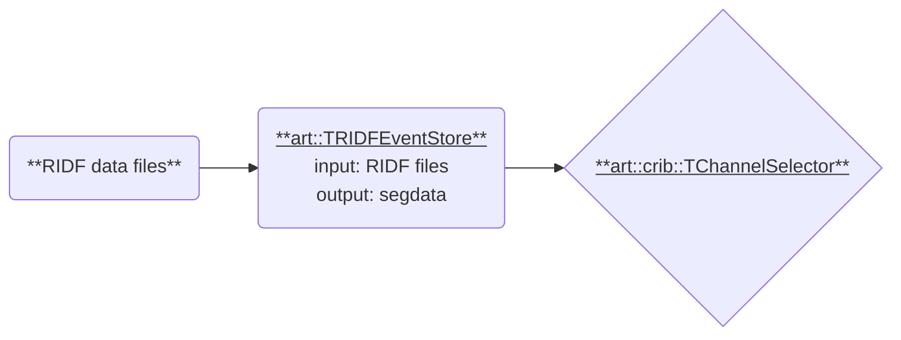

# Processing Segmented Data

This section explains how to create a processor, `TChannelSelector`, to extract specific channel data from `segdata` and store it in a TTree.
Along the way, we will explore the structure and contents of `segdata`.

For more details on how `segdata` is generated, see [Read RIDF files](../preparation/ridf.md).

## Processor Overview



We aim to create a processor with the following specifications:

- **Name**: `TChannelSelector`
- **Namespace**: `art::crib` (specific to CRIB development)
- **Input**: `segdata`
- **Output**: A branch, containing a `TClonesArray` of `art::TSimpleData` objects.

> **Note**:
> The current implementation of [art::TOutputTreeProcessor](https://github.com/artemis-dev/artemis/blob/develop/sources/loop/TOutputTreeProcessor.cc) does not support writing primitive data types (e.g., `int` or `double`) to branches.
> Instead, we use `art::TSimpleData` (a class with a single member `fValue`) and wrap it in a `TClonesArray`.

### Example Steering File

Below is an example structure for the steering file:

```yaml
Anchor:
  - &input ridf/@NAME@@NUM@.ridf
  - &output output/@NAME@/@NUM@/test@NAME@@NUM@.root

Processor:
  - name: timer
    type: art::TTimerProcessor

  - name: ridf
    type: art::TRIDFEventStore
    parameter:
      OutputTransparency: 1
      InputFiles:
        - *input

  - name: channel
    type: art::crib::TChannelSelector
    parameter:
      parameter: hoge # add later

  - name: outputtree
    type: art::TOutputTreeProcessor
    parameter:
      FileName:
        - *output
```

## Initial Setup

1. Create header and source files for `TChannelSelector` following [General Processors](./general_processors.md).
   Ensure that the class is registered in `artcrib_linkdef.h` and `CMakeLists.txt`.

2. Build and install the project to confirm the skeleton files work correctly:

```shell
artlogin <username>
cd build
cmake ..
make
make install
```

3. Verify that artemis starts without errors:

```shell
acd
a
# -> No errors
```

## Understanding `segdata`

### Accessing `segdata`

To access `segdata`, add the following member variables to the header file:

```cpp
class TChannelSelector : public TProcessor {
  private:
    TString fSegmentedDataName; // Name of the input object
    TSegmentedData **fSegmentedData; //! Pointer to the segdata object

    ClassDefOverride(TChannelSelector, 0);
};
```

Next, register the input collection name in the constructor using `RegisterInputCollection`:

```cpp
TChannelSelector::TChannelSelector() : fSegmentedData(nullptr) {
    RegisterInputCollection("SegmentedDataName", "name of the segmented data",
                            fSegmentedDataName, TString("segdata"));
}
```

Explanation of Arguments:

- **Name**: Used in the steering file to specify the parameter.
- **Description**: A brief explanation of the variable.
- **Variable**: Stores the parameter's value
- **Default value**: Used if the parameter is not set in steering file.

Finally, retrieve the actual object in the `Init` method:

```cpp
#include <TSegmentedData.h>

void TChannelSelector::Init(TEventCollection *col) {
    void** seg_ref = col->GetObjectRef(fSegmentedDataName);
    if (!seg_ref) {
        SetStateError(Form("No such input collection '%s'\n", fSegmentedDataName.Data()));
        return;
    }

    auto *seg_obj = static_cast<TObject *>(*seg_ref);
    if (!seg_obj->InheritsFrom("art::TSegmentedData")) {
        SetStateError(Form("'%s' is not of type art::TSegmentedData\n", fSegmentedDataName.Data()));
        return;
    }

    fSegmentedData = reinterpret_cast<TSegmentedData **>(seg_obj);
}
```

**Step-by-Step Explanation**:

1. **Retrieve Object Reference**: Use `GetObjectRef` (return `void **`) to retrieve the object associated with the name in `fSegmentedDataName`.
   If the object is not found, log an error and exits.

2. **Validate Object Type**: Check that the object inherits from `art::TSegmentedData` using `InheritsFrom`.
   This ensures compatibility during casting.

3. **Store Object**: Cast the object to `TSegmentedData` and store it in `fSegmentedData` for later use.

### Exploring `segdata` Structure

`art::TSegmentedData` inherits from `TObjArray`, with each entry corresponding to a `[dev, fp, mod]` tuple.
The following code outputs the structure of `segdata` for each event:

```cpp
void TChannelSelector::Process() {
    auto nSeg = fSegmentedData->GetEntriesFast();
    for (int iSeg = 0; iSeg < nSeg; iSeg++) {
        auto *seg = fSegmentedData->UncheckedAt(iSeg);

        int id = seg->GetUniqueID();
        // id is generated by `id = (dev << 20) + (fp << 14) + (mod << 8)`
        int dev = (id >> 20) & 0xFFF;
        int fp = (id >> 14) & 0x3F;
        int mod = (id >> 8) & 0x3F;

        std::cout << "iSeg=" << iSeg << ", [dev=" << dev << ", fp=" << fp << ", mod=" << mod << "]\n";
    }
}
```

Example output:

```plaintext
iSeg=0, [dev=12, fp=1, mod=6]
iSeg=1, [dev=12, fp=1, mod=60]
iSeg=2, [dev=12, fp=2, mod=7]
...
```

### Decoded Data Overview

The following table summarizes the decoded data classes used for different modules:

| Module            | Class                     | Description                                                                                                                                                          |
| ----------------- | ------------------------- | -------------------------------------------------------------------------------------------------------------------------------------------------------------------- |
| V7XX (V775, V785) | `art::TRawTiming`         | Inherits from `art::TRawDataObject` -> `art::TRawDataSimple` -> `art::TRawTiming`. Although the name indicates timing data, ADC data are also handled by this class. |
| MXDC32 (MADC32)   | `art::TRawTiming`         | Same as above.                                                                                                                                                       |
| V1190             | `art::TRawTimingWithEdge` | Inherits from `art::TRawTiming` -> `art::TRawTimingWithEdge`. This class is designed to handle both leading edge and trailing edge timing data.                      |

These modules are commonly used in CRIB experiments.
Note that other type the modules such as scaler are not covered in this page.

**Key Features**:

- **Unified Access**: All decoded objects inherit from `art::TRawDataObject`, allowing consistent access methods.
- **Virtual Functions**: Access data (e.g., `geo`, `ch`, `val`) using the same methods across different modules.

### Extracting Specific Segments

To extract data for a specific segment (`[dev, fp, mod]`), use `FindSegment`:

```cpp
#include <TRawDataObject.h>

void TChannelSelector::Process() {
    auto *seg_array = fSegmentedData->FindSegment(12, 0, 7);
    if (!seg_array) {
        Warning("Process", "No segment having segid = [dev=12, fp=0, mod=7]");
        return;
    }

    auto nData = seg_array->GetEntriesFast();
    for (int iData = 0; iData < nData; iData++) {
        auto *data = (TRawDataObject *)seg_array->UncheckedAt(iData);
        int geo = data->GetGeo();
        int ch = data->GetCh();
        int val = data->GetValue();
        std::cout << "iData=" << iData << ", [geo=" << geo << ", ch=" << ch << ", val=" << val << "]\n";
    }
}
```

**Process Explanation**

1. **Retrieve Segment Array**:
   The `FindSegment` method (return `TObjArray *`) contains all entries for the specified segment ID (`[dev, fp, mod]`).
   If the segment does not exist, a warning is logged, and the method exits.
2. **Iterate Through Entries**:
   Each entry in the segment array represents a data point for the specified segment.
   Use `UncheckedAt` or `At` to access individual entries and extract properties like `geo`, `ch`, and `val` using methods of `art::TRawDataObject`.

Example output:

```plaintext
iData=0, [geo=0, ch=2, val=9082]
iData=1, [geo=0, ch=2, val=9554]
iData=2, [geo=0, ch=0, val=25330]
iData=3, [geo=0, ch=0, val=26274]
iData=4, [geo=1, ch=2, val=9210]
iData=5, [geo=1, ch=2, val=9674]
iData=6, [geo=1, ch=0, val=25449]
...
```

## Implementing `TChannelSelector`

### Preparing Parameters

To specify the target segment and channels, add a `SegID` parameter (`[dev, fp, mod, geo, ch]`) in the steering file:

```yaml
- name: channel
  type: art::crib::TChannelSelector
  parameter:
    SegID: [12, 0, 7, 0, 2]
```

**Implementation**:

1. **Declare Member Variable**: Add a member variable to the header file to store the `SegID` parameter:

   ```cpp
   class TChannelSelector : public TProcessor {
     private:
       IntVec_t fSegID; //!
   }
   ```

2. **Register Parameter**: Use `RegisterProcessorParameter` in the constructor to read the parameter from the steering file:

   ```cpp
   TChannelSelector::TChannelSelector() : fSegmentedData(nullptr) {
       IntVec_t init_i_vec;
       RegisterProcessorParameter("SegID", "segment ID, [dev, fp, mod, geo, ch]",
                                  fSegID, init_i_vec);
   }
   ```

3. **Validate Parameter**: Validate the `SegID` size in the `Init` method:

   ```cpp
   void TChannelSelector::Init(TEventCollection *col) {
       if (fSegID.size() != 5) {
           SetStateError("parameter: SegID size is not 5, input [dev, fp, mod, geo, ch]\n");
           return;
       }
       Info("Init", "Process [dev=%d, fp=%d, mod=%d, geo=%d, ch=%d]", fSegID[0], fSegID[1], fSegID[2], fSegID[3], fSegID[4]);
   }
   ```

### Preparing Output Branch

To store extracted data, create a ROOT branch using `TClonesArray`:

1. **Declare Member Variables**: Add member variables for the output branch in the header file:

   ```cpp
   class TChannelSelector : public TProcessor {
     private:
       TString fOutputColName;
       TClonesArray *fOutData; //!
   }
   ```

2. **Register Output Collection**: Register the branch name in the constructor:

   ```cpp
   TChannelSelector::TChannelSelector() : fSegmentedData(nullptr), fOutData(nullptr) {
       RegisterOutputCollection("OutputCollection", "name of the output branch",
                                fOutputColName, TString("output"));
   }
   ```

3. **Steering File**: Add `SegID` parameter in the steering file:

   ```yaml
   - name: channel
     type: art::crib::TChannelSelector
     parameter:
       OutputCollection: channel
       SegID: [12, 0, 6, 0, 2] # add this parameter
   ```

4. **Initialize Output Branch**: Initialize the `TClonesArray` object in the `Init` method:

   ```cpp
   #include <TSimpleData.h>

   void TChannelSelector::Init(TEventCollection *col) {
       fOutData = new TClonesArray("art::TSimpleData");
       fOutData->SetName(fOutputColName);
       col->Add(fOutputColName, fOutData, fOutputIsTransparent);
       Info("Init", "%s -> %s", fSegmentedDataName.Data(), fOutputColName.Data());
   }
   ```

### Processing Events

Process events to extract and store data matching the specified `SegID`:

1. **Clear Data**: Ensure the output branch is cleared for each event:

   ```cpp
   void TChannelSelector::Process() {
       fOutData->Clear("C");
   }
   ```

2. **Extract and Store Data**: Use the following logic to extract and store data in `TClonesArray`:

```cpp
void TChannelSelector::Process() {
    auto *seg_array = fSegmentedData->FindSegment(fSegID[0], fSegID[1], fSegID[2]);
    if (!seg_array) {
        Warning("Process", "No segment having segid = [dev=%d, fp=%d, mod=%d]", fSegID[0], fSegID[1], fSegID[2]);
        return;
    }

    auto nData = seg_array->GetEntriesFast();
    int counter = 0;
    for (int iData = 0; iData < nData; ++iData) {
        auto *data = (TRawDataObject *)seg_array->UncheckedAt(iData);
        int geo = data->GetGeo();
        int ch = data->GetCh();
        if (data && geo == fSegID[3] && ch == fSegID[4]) {
            auto *outData = static_cast<art::TSimpleData *>(fOutData->ConstructedAt(counter));
            counter++;
            outData->SetValue(data->GetValue());
        }
    }
}
```

**Explanation**:

- **Clear Output**: `fOutData->Clear("C")` ensures no residual data from the previous event.
- **Filter Data**: Only entries matching `geo` and ch values from `SegID` are processed.
- **Store Data**: Use `ConstructedAt(counter)` to create new entries in the TClonesArray.

### Verifying the Implementation

After completing the implementation, use the following commands to test the processor:

```shell
artemis [] add steering/hoge.yaml NAME=xxxx NUM=xxxx
artemis [] res
artemis [] sus
artemis [] fcd 0
artemis [] tree->Scan("channel.fValue")
```

Example Output:

```plaintext
***********************************
*    Row   * Instance * channel.f *
***********************************
*        0 *        0 *      9314 *
*        0 *        1 *      9818 *
*        1 *        0 *           *
*        2 *        0 *      3842 *
*        2 *        1 *      4550 *
*        3 *        0 *           *
*        4 *        0 *      8518 *
*        4 *        1 *      9107 *
*        5 *        0 *           *
*        6 *        0 *           *
```

---

See the complete implementation:

- [TChannelSelector.h](https://github.com/CRIB-project/artemis_crib/blob/main/src-crib/TChannelSelector.h)
- [TChannelSelector.cc](https://github.com/CRIB-project/artemis_crib/blob/main/src-crib/TChannelSelector.cc)
