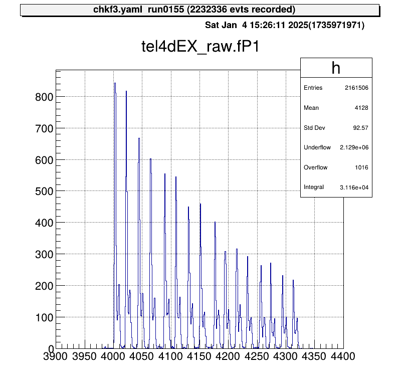
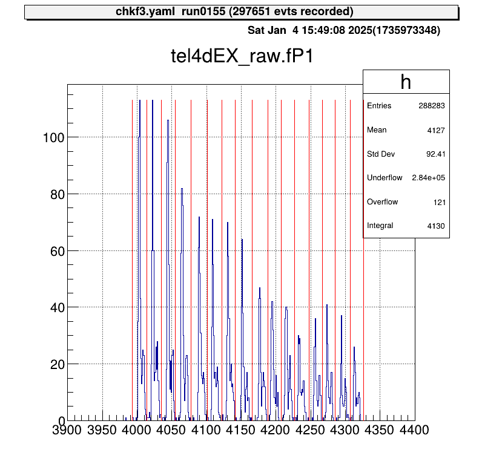
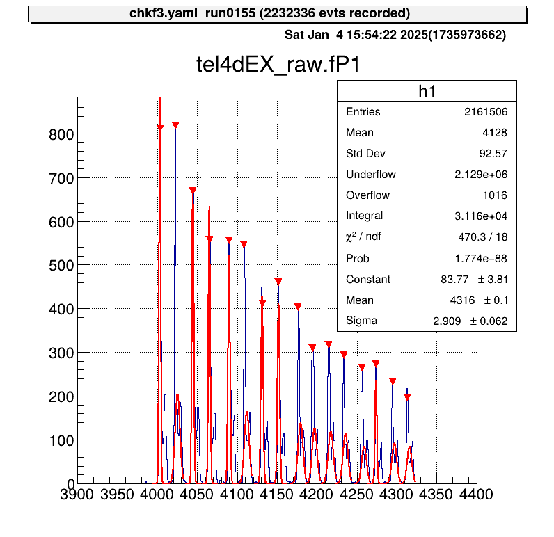

# MUX Calibration

<div class="warning">

Starting with the 2025 version, the structure of MUX parameter files and their loading method have been updated.
Please note that these changes are not backward-compatible with earlier versions.

</div>

At CRIB, we use the [MUX module by Mesytec](https://www.mesytec.com/products/nuclear-physics/MUX-16.html).
This multiplexer circuit is designed for strip-type Si detectors and consolidates five outputs:

- Two energy outputs (`E1`, `E2`),
- Two position outputs (`P1`, `P2`) for identifying the corresponding strip,
- One timing output (`T`) from the discriminator.

The MUX can handle up to two simultaneous hits per trigger, outputting them as `E1`, `E2`, and `P1`, `P2`.
In single-hit events, `E2` and `P2` remain empty.

<div class="warning">

Currently, handling for `E2` and `P2` outputs is not implemented.
In practice, most Si detector events involve a single hit per trigger, and coincidence events have not posed a problem.
If you need to process `E2` and `P2`, additional handling must be implemented.

</div>

This guide explains how to process data using the MUX in detail.

## Map File

Since the five outputs are processed as a single set, the `segid` in the map file is written in five columns.
Update the `mapper.conf` as follows:

```plaintext
conf/map/ssd/tel_dEX.map 5
```

In the map file, list the `segid` values in the order `[E1, E2, P1, P2, T]`:

```plaintext
# Map: MUX [ene1, ene2, pos1, pos2, timing]
#
#--------------------------------------------------------------------
40,  0, 12  1  6   4   16, 12  1  6   4   17, 12  1  6   4   18, 12  1  6   4   19, 12  2  7  0   70
```

In this example, you can access these data sets using `catid` 40.

## Checking Raw Data

To inspect raw data, use the `art::crib::TMUXDataMappingProcessor`:

```yaml
Processor:
  - name: MyTMUXDataMappingProcessor
    type: art::crib::TMUXDataMappingProcessor
    parameter:
      CatID: -1 # [Int_t] Category ID
      OutputCollection: mux # [TString] Name of the output branch
```

**Key Parameters**

- `CatID`: The `catid` specified in the map file.
- `OutputCollection`: The name of the output branch.

**Accessing `TMUXData` Type**

| Name   | Variable                    | Getter      |
| ------ | --------------------------- | ----------- |
| **E1** | `fE1`                       | `GetE1()`   |
| **E2** | `fE2`                       | `GetE2()`   |
| **P1** | `fP1`                       | `GetP1()`   |
| **P2** | `fP2`                       | `GetP2()`   |
| **T**  | `fTiming` (first hit)       | `GetTrig()` |
| **T**  | `fTVec[idx]` (timing array) | `GetT(idx)` |

For example, to examine the `P1` position signal:

```shell
artlogin <username>
a
```

```shell
artemis [] add steering/hoge.yaml NAME=xxxx NUM=xxxx
artemis [] res
artemis [] sus
artemis [] fcd 0
artemis [] zo
artemis [] tree->Draw("mux.fP1")
```



The position output appears as discrete signals, with each peak corresponding to a strip number.

If the map file includes multiple rows:

```plaintext
40,  0, 12  1  6   4   16, 12  1  6   4   17, 12  1  6   4   18, 12  1  6   4   19, 12  2  7  0   70
40,  1, 12  1  6   4   20, 12  1  6   4   21, 12  1  6   4   22, 12  1  6   4   23, 12  2  7  0   71
```

The output will be a two-element array.
To process this further, use `art::TSeparateOutputProcessor` to split the array into individual elements.
The YAML array index corresponds to the row in the map file:

```yaml
Processor:
  - name: MyTSeparateOutputProcessor
    type: art::TSeparateOutputProcessor
    parameter:
      InputCollection: inputname # [TString] name of input collection
      OutputCollections: # [StringVec_t] list of name of output collection
        - mux1
        - mux2
```

## Calibration

### What Is MUX Calibration?

To calibrate a detector using a MUX circuit, the position output must be mapped to its corresponding strip, and each event assigned to the correct strip.



In the current method, as illustrated, an event falling into two adjacent regions (from the left) is assigned to the corresponding `x`-th strip.
The goal of MUX calibration is to determine the red boundary values in the figure and save them in a parameter file.

### Calibration Macros

To streamline the MUX calibration process, two macros are provided:

- `macro/run_MUXParamMaker.C`: Runs the calibration macro and logs its execution.
- `macro/MUXParamMaker.C`: Contains the core function for performing MUX calibration.

The main calibration function, defined in `macro/MUXParamMaker.C`, requires the following arguments:

- `h1`: Histogram object.
- `telname`: Telescope name for specifying the output directory.
- `sidename`: Indicates whether it’s the X or Y direction strip (`"dEX"` or `"dEY"`), also used for directory naming.
- `runname`、 `runnum`: Used to generate the output file name to distinguish between different measurements.
- `peaknum`: Number of expected peaks (currently assumes 16 strips).

In `macro/run_MUXParamMaker.C`, use the `ProcessLine()` function to define calibration commands:

```cpp
void run_MUXParamMaker() {
    const TString ARTEMIS_WORKDIR = gSystem->pwd();

    const TString RUNNAME = "run";
    const TString RUNNUM = "0155";

    gROOT->ProcessLine("fcd 0");
    gROOT->ProcessLine("zone");

    gROOT->ProcessLine("tree->Draw(\"tel4dEX_raw.fP1>>h1(500,3900.,4400.)\")");
    gROOT->ProcessLine(".x " + ARTEMIS_WORKDIR + "/macro/MUXParamMaker.C(h1, \"tel4\", \"dEX\", \"" + RUNNAME + "\", \"" + RUNNUM + "\", 16)");
}
```

This macro records the calibration conditions.

To use it:

```shell
artemis [] add steering/hoge.yaml NAME=xxxx NUM=xxxx
artemis [] res
artemis [] sus
artemis [] .x macro/run_MUXParamMaker.C
```

Gaussian fitting is performed on each peak, and the parameter file is saved automatically.



### Applying Parameters

Parameter files are stored in directories like `prm/tel[1,2,...]/pos_dE[X, Y]/`.
To simplify access, predefined steering files use a symbolic link called `current`.

By changing this symbolic link, you can switch parameter files without modifying the steering file.
Use the `setmuxprm.sh` script to manage these symbolic links.

This script requires `gum` and `realpath`.
Run the script interactively to create a current link pointing to the desired parameter file:

```shell
./setmuxprm.sh
```

### Verifying Parameters

To verify the parameters, use the `macro/chkmuxpos.C` macro.

1. Generate a histogram of `P1` in Artemis.
2. Overlay the boundary lines from the current parameter file.

```shell
artlogin <username>
a
```

```shell
artemis [] add steering/hoge.yaml NAME=xxxx NUM=xxxx
artemis [] res
artemis [] sus
artemis [] fcd 0
artemis [] tree->Draw("mux.fP1>>h1")
```

To draw the boundaries on the histogram `h1`:

```shell
artemis [] .x macro/chkmuxpos.C(h1, "telname", "sidename")
```

**Arguments**:

- `h1`: Histogram object.
- `telname`: Telescope name, used for locating the parameter file.
- `sidename`: Specify `"dEX"` or `"dEY"`, also used for locating the parameter file.


This visual representation helps confirm that each peak aligns with its designated region.

## Energy Calibration

Energy calibration is performed on a strip-by-strip basis, so strip assignment must be completed beforehand.

### Parameter Objects

To load the necessary parameters into Artemis and use them in a processor, employ the `art::TParameterArrayLoader`:

```yaml
Processor:
  - name: proc_@NAME@_dEX_position
    type: art::TParameterArrayLoader
    parameter:
      Name: prm_@NAME@_dEX_position
      Type: art::crib::TMUXPositionConverter
      FileName: prm/@NAME@/pos_dEX/current
      OutputTransparency: 1
```

**Processor Parameters**:

- `Name`: Specifies the name of the parameter object.
- `Type`: Specifies the class type of the parameter.
- `FileName`: Path to the parameter file.
- `OutputTransparency`: Set to 1 since parameter objects do not need to be saved in ROOT files.

### Strip Assignment with `TMUXCalibrationProcessor`

Strip assignment is handled using the `art::crib::TMUXCalibrationProcessor`:

```yaml
Processor:
  - name: MyTMUXDataMappingProcessor
    type: art::crib::TMUXDataMappingProcessor
    parameter:
      CatID: -1 # [Int_t] Category ID
      OutputCollection: mux_raw # [TString] Name of the output branch

  - name: MyTMUXCalibrationProcessor
    type: art::crib::TMUXCalibrationProcessor
    parameter:
      InputCollection: mux_raw # [TString] Array of TMUXData objects
      OutputCollection: mux_cal # [TString] Output array of TTimingChargeData objects
      ChargeConverterArray: no_conversion # [TString] Energy parameter object of TAffineConverter
      TimingConverterArray: no_conversion # [TString] Timing parameter object of TAffineConverter
      PositionConverterArray: prm_@NAME@_dEX_position # [TString] Position parameter object of TMUXPositionConverter
      HasReflection: 0 # [Bool_t] Reverse strip order (0--7) if true
```

> **Note**: In CRIB, the Y-direction strip numbering for silicon detectors differs between geometric and output pin order.
> Set `HasReflection` to `True` to reverse the strip order and align it with the natural geometric sequence.

The `PositionConverterArray` parameter is mandatory for strip assignment.
Energy and timing converters are optional; if left unspecified, the raw values are returned.

### Performing Energy Calibration

The objects output by `art::crib::TMUXCalibrationProcessor` (`mux_cal`) are of type `art::TTimingChargeData`.
The `fID` field corresponds to the `detid` (i.e., the strip number).
Therefore, energy calibration can be conducted in a manner similar to the [Alpha Calibration](./alpha_calibration.md) section.

> **Important**: Perform energy calibration using the output from the calibration processor, not the mapping processor.

## Summary

- **MUX Calibration**: Aligns the position output with the corresponding strips by determining and storing boundary values in parameter files.
- **Parameter Loading**: Use `art::TParameterArrayLoader` to load parameters for strip assignment into Artemis.
- **Strip Assignment**: Employ `art::crib::TMUXCalibrationProcessor` to complete strip assignment before performing energy calibration.
- **Calibration Workflow**:
  - `PositionConverterArray` is required for strip assignment.
  - Energy and timing converters are optional; raw values are used if not specified.
- **Energy Calibration**: Conducted on the processor output to ensure proper alignment of detector strips.
