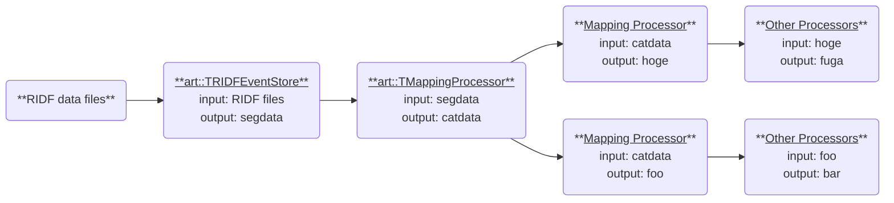

# Read RIDF Files

This section explains how to read RIDF files using `artemis`.
Currently, binary RIDF files are processed using two classes: `art::TRIDFEventStore` and `art::TMappingProcessor`.

## Using `art::TRIDFEventStore` to Read Data

To load data from a RIDF file, use `art::TRIDFEventStore`.
Here is an example of a steering file:

```yaml
Anchor:
  - &input ridf/@NAME@@NUM@.ridf
  - &output output/@NAME@/@NUM@/hoge@NAME@@NUM@.root
  - &histout output/@NAME@/@NUM@/hoge@NAME@@NUM@.hist.root

Processor:
  - name: timer
    type: art::TTimerProcessor

  - name: ridf
    type: art::TRIDFEventStore
    parameter:
      OutputTransparency: 1
      Verbose: 1
      MaxEventNum: 100000
      SHMID: 0
      InputFiles:
        - *input

  - name: outputtree
    type: art::TOutputTreeProcessor
    parameter:
      FileName:
        - *output
```

The `timer` processor shows analysis time and is commonly included.
The key section to note is the `ridf` block.

**Key Parameters**

| Parameter              | Defalut Value | Description                                                                                                            |
| ---------------------- | ------------- | ---------------------------------------------------------------------------------------------------------------------- |
| **OutputTransparency** | 0             | 0 saves output to a ROOT file, 1 keeps it for internal use only. (Inherited from `art::TProcessor`.)                   |
| **Verbose**            | 1             | 0 for quiet mode, 1 for detailed logs. (Inherited from `art::TProcessor`.)                                             |
| **MaxEventNum**        | 0             | 0 for no limit; otherwise specifies the number of entries to process.                                                  |
| **SHMID**              | 0             | Shared Memory ID for DAQ in online mode ([babirl](https://ribf.riken.jp/RIBFDAQ/index.php?DAQ/Download) `nssta` mode). |
| **InputFiles**         | Empty array   | List of input RIDF file paths. Files are processed sequentially into a single ROOT file.                               |

Unspecified parameters use default values.
Parameters inherited from `art::TProcessor` are common to all processors.

### Processing with `art::TRIDFEventStore`

The objects processed by this processor are difficult to handle directly.
It is common to set `OutputTransparency` to 1, meaning the objects will not be saved to a ROOT file.

To understand what is produced, you can set `OutputTransparency` to 0 to examine the output.

```shell
artlogin <username>
a
```

```shell
artemis [] add steering/hoge.yaml NAME=xxxx NUM=xxxx
artemis [] res
artemis [] sus
artemis [] fcd 0
artemis [] br
```

For detailed commands, refer to [the Artemis Commands section](../setting/commands.md).

Example output:

```plaintext
segdata              art::TSegmentedData
eventheader          art::TEventHeader
```

The `eventheader` is always output, while `segdata` is produced when `OutputTransparency` is set to 0.
Key data is contained in `segdata`.
Further details are covered in [subsequent sections](../new_processor/chapter.md).

## Using art::TMappingProcessor for Data Mapping

Raw RIDF files do not inherently indicate detector associations or processing rules.
Use mapping files, as explained in [the previous section](./map.md), to map the data.

Example steering file:

```yaml
Processor:
  - name: timer
    type: art::TTimerProcessor

  - name: ridf
    type: art::TRIDFEventStore
    parameter:
      OutputTransparency: 1
      Verbose: 1
      MaxEventNum: 100000
      SHMID: 0
      InputFiles:
        - *input

  - name: mapper
    type: art::TMappingProcessor
    parameter:
      OutputTransparency: 1
      MapConfig: mapper.conf

  - name: outputtree
    type: art::TOutputTreeProcessor
    parameter:
      FileName:
        - *output
```

**Key Parameters**

| Parameter     | Defalut Value | Description                                                                                |
| ------------- | ------------- | ------------------------------------------------------------------------------------------ |
| **MapConfig** | mapper.conf   | Path to the mapper configuration file. Defaults to `mapper.conf` in the working directory. |

This parameter allows custom mappings, such as focusing on specific data during standard analyses.
Use an alternative `mapper.conf` in another directory and specify its path when needed.

### Processing with `art::TMappingProcessor`

The outputs of this processor are also hard to use directly, so `OutputTransparency` is typically set to 1.
To examine what is produced, set it to 0 and observe the output.

```shell
artlogin <username>
a
```

```shell
artemis [] add steering/hoge.yaml NAME=xxxx NUM=xxxx
artemis [] res
artemis [] sus
artemis [] fcd 0
artemis [] br
```

Example output:

```plaintext
segdata              art::TSegmentedData
eventheader          art::TEventHeader
catdata              art::TCategorizedData
```

A new branch, `catdata`, is created.
It categorizes data from `segdata` and serves as the basis for detector-specific analyses.

### Workflow Diagram



Both `segdata` and `catdata` are typically set to `OutputTransparency: 1` and processed internally.
Understanding these objects is essential for mastering subsequent analyses.
