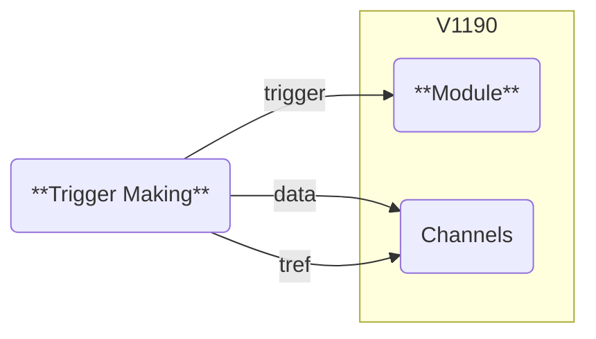
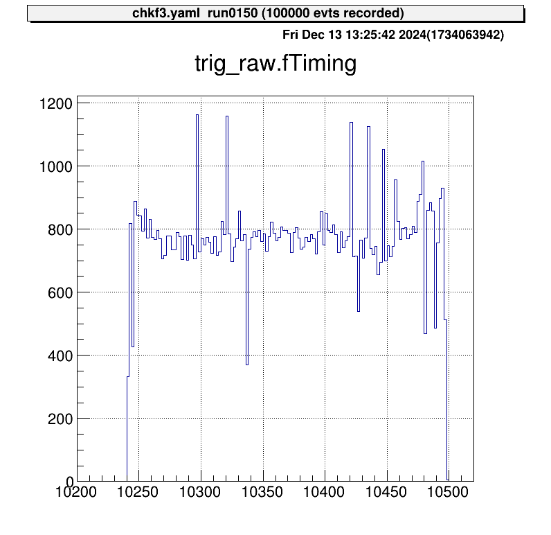
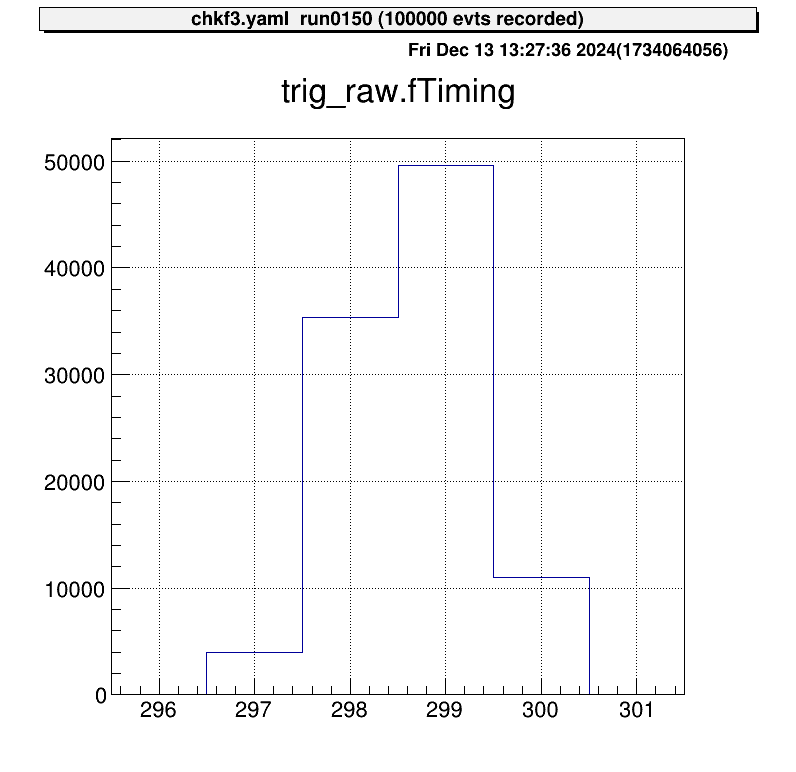

# Time Reference for V1190

At CRIB, [the CAEN V1190 module](https://www.caen.it/products/v1190a-2esst/) is used to acquire timing data in **Trigger Matching Mode**, where timing data within a specified window is recorded upon receiving a trigger signal.

The raw data from the module includes module-specific uncertainties.
To ensure accurate timing, corrections are required.
This section explains how to apply these corrections.

## Raw Data

To understand the behavior of the V1190, consider the following setup:



- The trigger signal is input directly to the V1190, and timing data is recorded using two channels.
- The recorded data is referred to as `data` and `tref`.

When `data` is examined without corrections, the result looks like this:



The horizontal axis represents the V1190 channel numbers.
In this example, one channel corresponds to approximately 0.1 ns, leading to an uncertainty of about 25 ns. Ideally, since this signal is a trigger, data points should align at nearly the same channel.

## Correction Using "Tref"

This uncertainty is consistent across all data recorded by the V1190 for the same event, meaning it is fully correlated across channels.
By subtracting a reference timing value (called `tref`) from all channels, this module-specific uncertainty can be corrected.

Below is an example of corrected `data` after subtracting `tref`:



The trigger signal now aligns at nearly the same channel.
Without this correction, V1190-specific uncertainties degrade resolution, making this correction essential.

> Any signal can be used as a `tref`, but it must be recorded some signals for all events.
> For simplicity, **the trigger signal** is often used as `tref`.

## Applying the Correction in Steering Files

The correction is implemented using the `steering/tref.yaml` file, which is maintained separately for easy reuse.
An example configuration is shown below:

```yaml
Processor:
  # J1 V1190A
  - name: proc_tref_v1190A_j1
    type: art::TTimeReferenceProcessor
    parameter:
      # [[device] [focus] [detector] [geo] [ch]]
      RefConfig: [12, 2, 7, 0, 0]
      SegConfig: [12, 2, 7, 0]
```

**Tref Processor Workflow**

1. Use the `art::TTimeReferenceProcessor`.
2. Specify `RefConfig` (**tref** channel) and `SegConfig` (target module).
3. The processor subtracts the channel specified in `RefConfig` from all data in the module identified by `SegConfig`.

Refer to [the ID scheme](./map.md) to correctly configure `RefConfig` and `SegConfig` for your DAQ setup.

### Adding the Tref Processor to the Main Steering File

Include the tref processor in the main steering file using the `include` keyword.
Ensure the tref correction is applied before processing other signals. For example:

```yaml
Anchor:
  - &input ridf/@NAME@@NUM@.ridf
  - &output output/@NAME@/@NUM@/hoge@NAME@@NUM@.root
  - &histout output/@NAME@/@NUM@/hoge@NAME@@NUM@.hist.root

Processor:
  - name: timer
    type: art::TTimerProcessor

  - name: ridf
    type: art::TRIDFEventStore
    parameter:
      OutputTransparency: 1
      InputFiles:
        - *input
      SHMID: 0

  - name: mapper
    type: art::TMappingProcessor
    parameter:
      OutputTransparency: 1

  # Apply tref correction before other signal processing
  - include: tref.yaml

  # Process PPAC data with corrected timing
  - include: ppac/dlppac.yaml

  - name: outputtree
    type: art::TOutputTreeProcessor
    parameter:
      FileName:
        - *output
```
