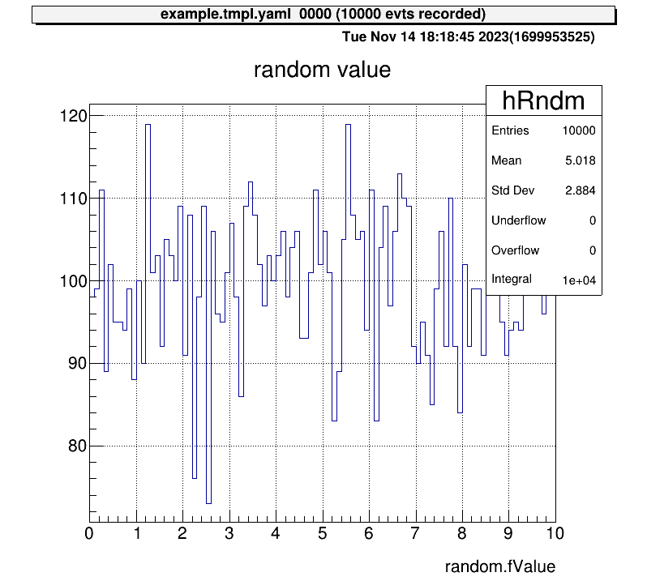

# Run a Example Code

This section provides a hands-on demonstration of how to use `artemis_crib` with an example code.

## Step 1: Log In to the Working Directory

Log in to the user’s working directory using the `artlogin` command:

```shell
artlogin username
```

This command loads the necessary environment variables for the user.
Once logged in, you can start the `artemis` interpreter:

```shell
a
```

<div class="warning">

**Note:** If connected via SSH, ensure X11 forwarding is configured or use a VNC server to view the canvas.
Refer to the [VNC server sections](./vnc_server.md) for setup details.

</div>

When the `artemis` interpreter starts, you should see the prompt:

```plaintext
artemis [0]
```

If errors occur, verify that the source code has been built and that the `thisartemis-crib.sh` file has been sourced.

## Step 2: Load the Example Steering File

`artemis` uses a YAML-based **steering file** to define data and analysis settings.
For this example, use the steering file `steering/example/example.tmpl.yaml`.

Load the file with the `add` command with the path of the steering file:

```shell
artemis [] add steering/example/example.tmpl.yaml NUM=0001 MAX=10
```

- **NUM**: Used for file naming.
- **MAX**: Specifies the maximum value for a random number generator.

> These arguments are defined in the steering file.
> Refer to the [Steering files section](./steering.md).

## Step 3: Run the Event Loop

Start the event loop using the `resume` command (or its abbreviation, `res`):

```shell
artemis [] res
```

Once the loop completes, you’ll see output like:

```plaintext
Info in <art::TTimerProcessor::PostLoop>: real = 0.02, cpu = 0.02 sec, total 10000 events, rate 500000.00 evts/sec
```

To pause the loop, use the `suspend` command (abbreviation: `sus`):

```shell
artemis [] sus
```

## Step 4: View Histograms

### Listing Histograms

Use the `ls` command to list available histograms:

```shell
artemis [] ls
```

Example output:

```plaintext
 artemis
>   0 art::TTreeProjGroup test2           test (2)
    1 art::TTreeProjGroup test            test
    2 art::TAnalysisInfo analysisInfo
```

The histograms are organized into directories represented by the `art::TTreeProjGroup` class.
This class serves as a container for multiple histograms, making it easier to manage related data.

Navigate to a histogram directory using its ID or name:

```shell
artemis [] cd 1
```

or:

```shell
artemis [] cd test
```

Once inside the directory, use the `ls` command to view its contents:

```shell
artemis [] ls
```

```plaintext
 test
>   0 art::TH1FTreeProj hRndm           random value
```

Here, `art::TH1FTreeProj` is a customized class derived from `TH1F`, designed for efficient analysis within `artemis`.

### Drawing Histograms

Draw a histogram using the `ht` command with its ID or name:

```shell
artemis [] ht 0
```



To return to the root directory, use:

```shell
artemis [] cd
```

To move one directory up, use:

```shell
artemis [] cd ..
```

This moves you up one level in the directory structure.

## Step 5: View Tree Data

After the event loop, a ROOT file containing `tree` objects is created.
List available files using `fls`:

```shell
artemis [] fls
```

```plaintext
 files
    0 TFile output/0001/example_0001.tree.root            (CREATE)
```

Navigate into the ROOT file using `fcd` with the file ID:

```shell
artemis [] fcd 0
```

### Listing Branches

List tree branches with `branchinfo` (or `br`):

```shell
artemis [] br
```

```plaintext
 random               art::TSimpleData
```

View details of a branch’s members and methods:

```shell
artemis [] br random
```

```plaintext
art::TSimpleData

Data Members


Methods

                  Bool_t   CheckTObjectHashConsistency
            TSimpleData&   operator=
            TSimpleData&   operator=

See also

    art::TSimpleDataBase<double>
```

To explore inherited classes, use `classinfo` (or `cl`):

```shell
artemis [] cl art::TSimpleDataBase<double>
```

```plaintext
art::TSimpleDataBase<double>

Data Members

                  double   fValue

Methods

                    void   SetValue
                  double   GetValue
                  Bool_t   CheckTObjectHashConsistency
  TSimpleDataBase<double>&   operator=

See also

    art::TDataObject       base class for data object
```

### Drawing Data from Trees

Unlike standard ROOT files, data in `artemis` cannot be accessed directly through branch names.
Instead, use member variables or methods of the branch objects.

Example:

```shell
artemis [] tree->Draw("random.fValue")
artemis [] tree->Draw("random.GetValue()")
```
