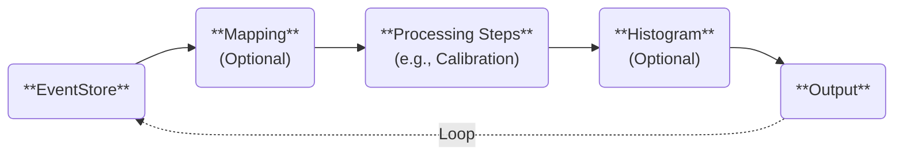

# Steering Files

Steering files define the configuration for the data analysis flow in YAML format.
This section explains their structure and usage using the example file `steering/example/example.tmpl.yaml` from [the previous section](./commands.md).

## Understanding the Steering File

The content of `steering/example/example.tmpl.yaml` is structured as follows:

```yaml
Anchor:
  - &treeout output/@NUM@/example_@NUM@.tree.root
  - &histout output/@NUM@/example_@NUM@.hist.root
Processor:
  - name: timer
    type: art::TTimerProcessor
  - include:
      name: rndm.inc.yaml
      replace:
        MAX: @MAX@
  - name: hist
    type: art::TTreeProjectionProcessor
    parameter:
      FileName: hist/example/example.hist.yaml
      OutputFilename: *histout
      Type: art::TTreeProjection
      Replace: |
        MAX: @MAX@
  - name: treeout
    type: art::TOutputTreeProcessor
    parameter:
      FileName: *treeout
```

The file is divided into two main sections:

- `Anchor`: Defines reusable variables using the YAML anchor feature (`&name value`), which can be referenced later as `*name`.
- `Processor`: Specifies the sequence of processing steps for the analysis.

### Variables Enclosed in `@`

Variables such as `@NUM@` and `@MAX@` are placeholders replaced dynamically when loading the steering file via the `artemis` command:

```shell
artemis [] add steering/example/example.tmpl.yaml NUM=0001 MAX=10
```

For example, the `Anchor` section is replaced as follows:

```yaml
Anchor:
  - &treeout output/0001/example_0001.tree.root
  - &histout output/0001/example_0001.hist.root
```

This allows the steering file to adapt dynamically to different analysis configurations.

## Data Processing Flow

When `artemis` runs, the processors defined in the `Processor` section are executed sequentially.
For example, the first processor in `example.tmpl.yaml` is:

```yaml
- name: timer
  type: art::TTimerProcessor
```

Each processor entry requires the following keys:

- `name`: A unique identifier for the process, aiding in debugging and logging.
- `type`: Specifies the processor class to use.
- `parameter` (optional): Defines additional parameters for the processor.

The general structure of any steering file is as follows:

```yaml
- name: process1
  type: art::THoge1Processor
  parameter:
    prm1: hoge

- name: process2
  type: art::THoge2Processor
  parameter:
    prm2: hoge

- name: process3
  type: art::THoge3Processor
  parameter:
    prm3: hoge
```

Processors are executed in the order they appear in the file.

### Referencing Other Steering Files

For modular or repetitive configurations, other steering files can be included using the `include` keyword.
For example:

```yaml
  - include:
      name: rndm.inc.yaml
      replace:
        MAX: @MAX@
```

**Content of `rndm.inc.yaml`**

```yaml
Processor:
  - name: MyTRandomNumberEventStore
    type: art::TRandomNumberEventStore
    parameter:
      Max: @MAX@  # [Float_t] the maximum value
      MaxLoop: 10000  # [Int_t] the maximum number of loops
      Min: 0  # [Float_t] the minimum value
      OutputCollection: random  # [TString] output name of random values
      OutputTransparency: 0  # [Bool_t] Output is persistent if false (default)
      Verbose: 1  # [Int_t] verbose level (default 1: non-quiet)
```

The flow of variable replacement is as follows:

1. `MAX=10` is passed via the `artemis` command.
2. `@MAX@` in `example.tmpl.yaml` is replaced with `10`.
3. The `replace` directive in `example.tmpl.yaml` propagates this value to `rndm.inc.yaml`.
4. `@MAX@` in `rndm.inc.yaml` is replaced with `10`.

### Other Processing Steps

The remaining processors in the file handle histogram generation and saving data to a ROOT file:

```yaml
  - name: hist
    type: art::TTreeProjectionProcessor
    parameter:
      FileName: hist/example/example.hist.yaml
      OutputFilename: *histout
      Type: art::TTreeProjection
      Replace: |
        MAX: @MAX@

  - name: treeout
    type: art::TOutputTreeProcessor
    parameter:
      FileName: *treeout
```

- **Histogram generation** is detailed in [the next section](./histogram.md).
- **Output tree processing** saves data to a ROOT file, utilizing aliases (`*treeout`) defined in the `Anchor` section.

## General Structure of a Steering File

Steering files typically include the following processors:

- **Timer**: Measures processing time but does not affect data analysis.
- **EventStore**: Handles event information for loops.
- **Mapping**: Maps raw data to detectors.
- **Processing steps**: Performs specific data analysis tasks.
- **Histogram**: Generates histograms from processed data.
- **Output**: Saves processed data in ROOT file format.



## Summary

- Steering files define the analysis flow using YAML syntax.
- Dynamic variables enclosed in `@` are replaced with command-line arguments.
- The `Processor` section specifies the sequence of processing tasks.
- Use `include` to reference other steering files for modular configurations.
- Typical components include timers, data stores, mappings, processing steps, histograms, and output.
