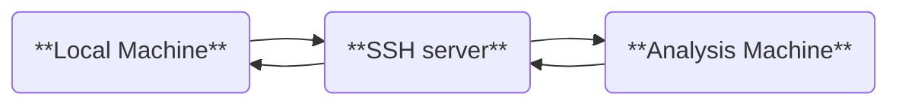

# VNC Server (option)

When performing data analysis, direct access to the server is not always practical.
Many users connect via SSH, which can complicate graphical displays.
While alternatives such as X11 forwarding or saving images exist, VNC is often preferred due to its lightweight design and fast rendering capabilities.
This section explains how to set up and use a VNC server for visualization.

## Setting Up the VNC Server

To use VNC, a VNC server must be installed on the analysis server.
Popular options include `TigerVNC` and `TightVNC`.
For CRIB analysis servers, `TightVNC` is the chosen implementation.

### Installing TightVNC

To install TightVNC on an Ubuntu machine, use the following commands:

```shell
sudo apt update
sudo apt install tightvncserver
```

On CRIB servers, VNC is used solely to render artemis canvases.
No desktop environment is installed.
For further details, refer to the official TightVNC documentation.

### Starting the VNC Server

Start the VNC server with the following command:

```shell
vncserver :10
```

Here, `:10` specifies the display number, and the VNC server will run on port `5910` (calculated as `5900 + display number`).

#### Checking Active VNC Servers

If multiple VNC processes are active, using an already occupied display number will cause an error.
Check active VNC processes with the `vnclist` command, defined as an alias on CRIB servers:

```shell
vnclist
```

Example output:

```plaintext
Xtightvnc :23
Xtightvnc :3
```

Alias definition:

```plaintext
vnclist: aliased to pgrep -a vnc | awk '{print $2,$3}'
```

## Configuring `artemis` to Use VNC

To render `artemis` canvases on the VNC server, the `DISPLAY` environment variable must be set correctly.
The `a` command automates this process.

### How the `a` Command Works

The `a` command is defined as follows:

```bash
a() {
  if [ ! -e "artemislogon.C" ]; then
    printf "\033[1ma\033[0m: 'artemislogon.C' not found\n"
    return 1
  fi

  if [ -z "${SSH_CONNECTION:-}" ]; then
    artemis -l "$@"
  elif [ -f ".vncdisplay" ]; then
    DISPLAY=":$(cat .vncdisplay)" artemis -l "$@"
  else
    artemis -l "$@"
  fi
}
```

**Explanation:**

1. If `artemislogon.C` is missing in the current directory, the command exits.
2. If not connected via SSH, `artemis -l` runs using the local display.
3. If `.vncdisplay` exists, its content is read to set the `DISPLAY` variable before launching `artemis`.
4. Otherwise, `artemis -l` runs with default settings.

### Configuring `.vncdisplay`

To direct `artemis` canvases to the VNC server:

1. Create a `.vncdisplay` file in your working directory.
2. Add the display number (e.g., `10`) as its content:
   ```plaintext
   10
   ```
3. Start `artemis` using the `a` command. The canvas should now appear on the VNC server.

## Configuring the VNC Client

To view canvases, you must connect to the VNC server using a VNC client.
Popular options include [RealVNC](https://www.realvnc.com/en/).

### Connecting to the Server

If the client machine is on the same network as the server, connect using the server’s IP address (or hostname) and port number:

```plaintext
<analysis-server-ip>:5910
```

- The port number is `5900 + display number`.
- If prompted for a password, use the one set during the VNC server setup or contact the CRIB server administrator.

## Using SSH Port Forwarding for Remote Access

When accessing the analysis server from an external network (e.g., from home), direct VNC connections are typically blocked.
SSH port forwarding allows secure access in such cases.



### Multi-Hop SSH Setup

If a gateway server is required for access, configure multi-hop SSH in your local machine’s `.ssh/config` file.
Example:

```plaintext
Host gateway
    HostName <gateway-server-ip>
    User <gateway-username>
    IdentityFile <path-to-private-key>
    ForwardAgent yes

Host analysis
    HostName <analysis-server-ip>
    User <analysis-username>
    IdentityFile <path-to-private-key>
    ForwardAgent yes
    ProxyCommand ssh -CW %h:%p gateway
    ServerAliveInterval 60
    ServerAliveCountMax 5
```

With this configuration, connect to the analysis server using:

```shell
ssh analysis
```

### Setting Up Port Forwarding

To forward the analysis server’s VNC port (e.g., `5910`) to a local port (e.g., `59010`):

1. Use the `-L` option in your SSH command:
   ```shell
   ssh -L 59010:<analysis-server-ip>:5910 analysis
   ```
2. Alternatively, add the `LocalForward` option to your `.ssh/config` file:
   ```plaintext
   Host analysis
       LocalForward 59010 localhost:5910
   ```
3. After connecting via SSH, start your VNC client and connect to:
   ```plaintext
   localhost:59010
   ```

You should now see the `artemis` canvases rendered on your local machine.

> **Note**: This is one example configuration. Customize the setup as needed for your environment.
